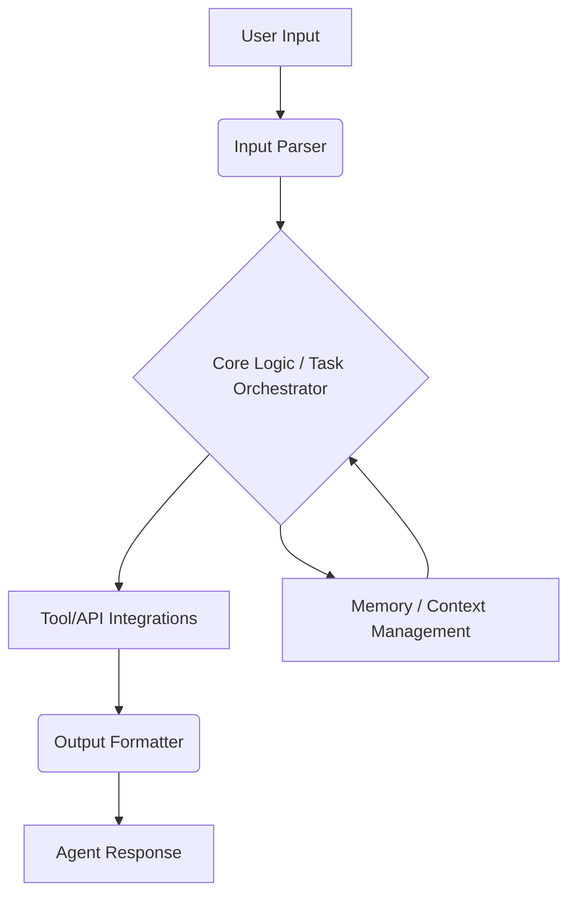

# my-agent

[](https://example.com/build-status)
[](https://example.com/license)
[](https://example.com/version)

## 1. Project Overview
`my-agent` is an intelligent software agent designed to automate tasks and interact with various systems through natural language commands. It aims to streamline workflows and provide a conversational interface for complex operations.

**Key Features:**
*   Natural language understanding for task interpretation.
*   Integration with external tools and APIs.
*   Context-aware decision making.
*   Extensible architecture for new capabilities.

## 1.2 Codebase Overview

Here's a brief overview of the main files and their purposes in this project:

*   `bun.lock`: Bun's lockfile, which records the exact versions of dependencies used in the project to ensure consistent installations.
*   `commit_index.ts`: This file appears to be an entry point for a code commit agent. It uses the `@ai-sdk/google` library to stream text, leveraging a `SYSTEM_COMMIT` prompt and a `getFileChangesInDirectoryTool` to generate professional commit messages based on code changes in a specified directory.
*   `commit.ts`: Defines the `SYSTEM_COMMIT` constant, which provides the system prompt for the commit-message generation agent. This prompt instructs the AI to act as a commit-message generator, using the Conventional Commits format to describe changes in a repository snapshot.
*   `index.ts`: This is the main entry point for the code review agent. It utilizes the `@ai-sdk/google` library to stream text, employing either `SYSTEM_PROMPT` or `SYSTEM_COMMIT` and the `getFileChangesInDirectoryTool` to review code changes and provide suggestions, ultimately generating a commit message.
*   `package.json`: Contains project metadata (name, version, description) and lists project dependencies and scripts.
*   `prompt.ts`: Defines the `SYSTEM_PROMPT` constant, which serves as the system prompt for the code review agent. This prompt outlines the agent's personality, review focus areas (correctness, clarity, maintainability, etc.), and guidelines for responding with constructive feedback.
*   `README.md`: This file, providing a comprehensive overview and documentation for the project.
*   `tools.ts`: Contains the `getFileChangesInDirectoryTool`, which is a custom AI tool. This tool uses `simple-git` to interact with a Git repository, calculating and returning the `diff` (code changes) for files within a specified directory, excluding certain files like `dist` and `bun.lock`.
*   `tsconfig.json`: TypeScript configuration file, specifying compiler options for the project.
*   `photos/`: A directory containing screenshots or other image assets.

## 2. Table of Contents
*   [1. Project Overview](#1-project-overview)
*   [2. Table of Contents](#2-table-of-contents)
*   [3. Installation](#3-installation)
*   [4. Usage](#4-usage)
*   [5. Configuration](#5-configuration)
*   [6. Architecture Overview](#6-architecture-overview)
*   [7. Testing](#7-testing)
*   [8. Deployment](#8-deployment)
*   [9. Contributing](#9-contributing)
*   [10. License](#10-license)
*   [11. Acknowledgements](#11-acknowledgements)

## 3. Installation

### Prerequisites
*   **Operating System:** Windows, macOS, or Linux
*   **Bun:** v1.2.22 or higher (https://bun.sh/docs/installation)
*   **Git:** Latest version for cloning the repository

### Step-by-step Commands

1.  **Clone the repository:**
    ```bash
    git clone https://github.com/your-org/my-agent.git
    cd my-agent
    ```

2.  **Install dependencies:**
    ```bash
    bun install
    ```

## 4. Usage

### Basic Invocation
To run the agent, use the following command:

```bash
bun run index.ts
```

### Example Input and Expected Output

**Input:**
```bash
bun run index.ts "What is the current time?"
```

**Expected Output:**
```
The current time is: [Current Time]
```
*(Note: Actual output may vary based on the agent's implementation and current time.)*

### Optional Flags/Configuration Options

| Flag          | Description                                     | Default Value |
| :------------ | :---------------------------------------------- | :------------ |
| `--debug`     | Enables verbose logging for debugging purposes. | `false`       |
| `--config`    | Specifies an alternative configuration file.    | `config.json` |
| `--model`     | Sets the AI model to use for natural language processing. | `default`     |

## 5. Configuration

The agent can be configured using environment variables or a `config.json` file.

### Environment Variables
*   `AGENT_API_KEY`: Your API key for external service integrations.
*   `AGENT_LOG_LEVEL`: Sets the logging verbosity (e.g., `INFO`, `DEBUG`, `ERROR`).

### Configuration File (`config.json`)
A `config.json` file can be placed in the project root to override default settings.

**Example `config.json`:**
```json
{
  "api_key": "your_api_key_here",
  "log_level": "DEBUG",
  "model": "advanced"
}
```

**Default Values:**
If no configuration is provided, the agent will use internal defaults for all settings.

## 6. Architecture Overview



**Component Roles:**
*   **User Input:** The natural language command or query provided by the user.
*   **Input Parser:** Processes and understands the user's input, extracting intent and entities.
*   **Core Logic / Task Orchestrator:** The brain of the agent, responsible for decision-making, task planning, and coordinating actions.
*   **Tool/API Integrations:** Connects the agent to external services, databases, or custom tools to perform actions.
*   **Memory / Context Management:** Stores and retrieves conversational context and learned information to enable more intelligent interactions.
*   **Output Formatter:** Structures the agent's response into a human-readable format.
*   **Agent Response:** The final output or action performed by the agent.

## 7. Testing

### Running Tests
To execute the test suite, use the following command:

```bash
bun test
```

### Coverage
Test coverage reports can be generated using:

```bash
bun test --coverage
```

## 8. Deployment

### Containerization (Docker)
A `Dockerfile` can be used to containerize the agent for consistent deployment across environments.

**Basic `Dockerfile` example:**
```dockerfile
# Use an official Bun runtime as a parent image
FROM oven/bun:1.2.22

# Set the working directory
WORKDIR /app

# Copy package.json and bun.lock to install dependencies
COPY package.json bun.lock ./

# Install dependencies
RUN bun install --frozen-lockfile

# Copy the rest of the application code
COPY . .

# Expose the port the app runs on (if applicable)
# EXPOSE 3000

# Command to run the application
CMD ["bun", "run", "index.ts"]
```

### Required Environment Variables for Production
Ensure the following environment variables are set in your production environment:
*   `AGENT_API_KEY`: (Mandatory) API key for production services.
*   `AGENT_ENVIRONMENT`: Set to `production`.
*   `AGENT_LOG_LEVEL`: Typically set to `INFO` or `ERROR` in production.

## 9. Contributing

We welcome contributions to `my-agent`! Please follow these guidelines:

### Code Style
*   Adhere to the existing TypeScript/JavaScript style.
*   Run `bun fmt` or `bun lint --fix` before submitting a pull request.

### Pull Request Process
1.  Fork the repository.
2.  Create a new branch (`git checkout -b feature/your-feature-name`).
3.  Make your changes and ensure tests pass.
4.  Commit your changes (`git commit -m "feat: Add new feature"`).
5.  Push to your branch (`git push origin feature/your-feature-name`).
6.  Open a pull request with a clear description of your changes.

## 10. License

This project is licensed under the MIT License - see the [LICENSE](LICENSE) file for details.

## 11. Acknowledgements

*   Built with [Bun](https://bun.sh).
*   Uses various open-source libraries (e.g., `commander` for CLI parsing, `axios` for HTTP requests).
*   Special thanks to all contributors.
